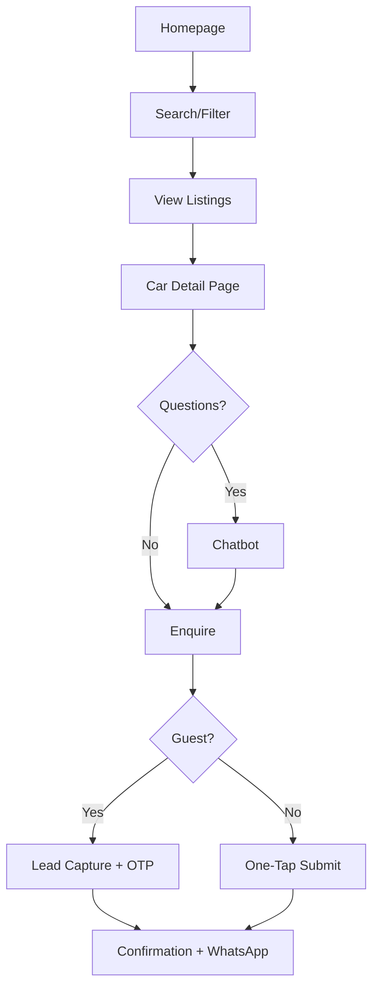
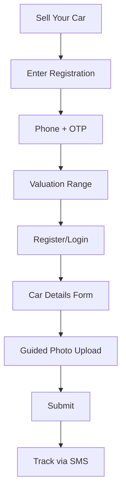

# UX Design Specification - Happy Cars

**Author:** Prabhakaranr
**Date:** 2026-01-07

---

## Executive Summary

### Project Vision

Happy Cars reimagines the used car marketplace through a consignment model that builds trust into the business itself. Rather than connecting anonymous buyers and sellers, Happy Cars takes physical possession of verified vehicles, handles the entire sales process, and provides professional support throughout.

The UX challenge is to make this invisible trust model *visible* - communicating safety, verification, and professionalism at every touchpoint while maintaining the warmth and approachability that "Happy" promises.

### Target Users

**Primary Personas:**

| Persona | Profile | Emotional State | Success Moment |
|---------|---------|-----------------|----------------|
| **Ravi (Buyer)** | 32yo IT professional, Chennai, family-focused | Skeptical, anxious about big purchase | "I understand why this car is priced this way" |
| **Lakshmi (Seller)** | 45yo school teacher, Coimbatore, time-constrained | Confused by quotes, seeking relief | "I just submitted, they handled everything" |
| **Priya (Admin)** | 28yo ops associate, manages daily operations | Needs efficiency under volume | "Smooth operations from submission to sale" |

**Behavioral Sub-Segments:**

| Segment | Behavior | UX Priority |
|---------|----------|-------------|
| **Serious Buyer** | Filters narrow, views details, enquires | Speed, detail depth |
| **Browser** | Wide filters, many thumbnails, no enquiry | Discovery, comparison |
| **Anxious Seller** | Valuation-first, hesitant to commit | Reassurance, simplicity |
| **Confident Seller** | Direct to submission form | Efficiency, minimal steps |

### Key Design Challenges

1. **Trust Communication** - Translate the consignment model into visual language that instantly signals "verified, safe, real"

2. **Lead Capture Friction** - Balance business need for phone+OTP capture with user perception of value exchange. Track valuation completion rate as key metric.

3. **Seller Photo Journey** - Guide first-time sellers through 3-9 photo upload with progressive per-image upload, retry logic, and compression for tier-2 city networks

4. **Cross-Platform Consistency** - Maintain unified mental model across React web and Flutter mobile using shared design tokens

5. **Chatbot Integration** - Visible but collapsed by default, user-initiated only (no auto-expand triggers)

6. **Seller Anxiety Reduction** - Address fear of judgment with messaging: "We evaluate all cars - no judgment"

### Design Opportunities

1. **"Showroom Verified" Visual System** - Enhanced badges with:
   - Specific showroom location (not just city)
   - Verification date ("Inspected Jan 5, 2026")
   - Photo source indicator ("Showroom Photos" vs "Seller Photos")

2. **Price Transparency as Differentiator** - Static "Price Breakdown" section on every listing showing factors + chatbot for deeper Q&A. This is a MASSIVE competitive gap in Indian market.

3. **Seller "Handoff" Narrative** - Frame entire seller experience as "give us the keys, we handle the rest"

4. **Tamil Nadu Context** - City filters, budget brackets, and brand preferences tuned to local market

### Brand Direction

**Color Palette (Final):**

| Color | Hex | Psychology | Usage |
|-------|-----|------------|-------|
| **Primary: Fresh Teal** | `#0D9488` | Trust, growth, differentiation | CTAs, brand, links |
| **Secondary: Deep Navy** | `#1A365D` | Trust, professionalism, reliability | Headers, navigation |
| **Accent: Success Green** | `#38A169` | Verified, approved, positive | Status indicators |
| **Neutral: Warm Gray** | `#4A5568` | Grounded, readable | Body text |
| **Background: Soft Cream** | `#FFFBF5` | Warmth, cleanliness | Page backgrounds |

**Rationale:** Teal differentiates from orange-heavy competitors (Spinny, Cars24) while conveying trust.

**Brand Personality:** "Friendly Expert"
- Professional enough for a major purchase decision
- Warm enough to feel like a helpful friend
- Confident without being pushy
- Transparent without being overwhelming

### Technical UX Constraints

*(From Architecture Review)*

- **Chatbot Loading:** Lazy-load component, don't block initial render
- **Photo Upload:** Progressive upload with per-image feedback, background queue with optimistic UI
- **Design Tokens:** Share colors, spacing, typography as code across React + Flutter
- **Verification States:** Design must account for "Pending Verification" state, not just verified
- **Mobile Networks:** Account for 3G speeds in tier-2 cities for all media-heavy operations

---

## Core User Experience

### Defining Experience

The Happy Cars experience centers on **trust conversion** - transforming skeptical browsers into confident enquirers, and hesitant sellers into relieved submitters.

**Core Actions:**
- **Buyer:** Browse → Filter → View Details → Enquire (trust → action)
- **Seller:** Valuation → Register → Submit → Track (confusion → relief)
- **Admin:** Review → Approve → Assign → Track (volume → efficiency)

The critical moment for buyers is the transition from browsing to enquiring - where trust must overcome hesitation. For sellers, it's the valuation reveal - a 3-second emotional reaction that determines submission.

### Platform Strategy

| Platform | Role | Navigation | Priority |
|----------|------|------------|----------|
| **React Web** | Discovery, SEO, detailed research | Top header with hamburger for secondary | Equal |
| **Flutter Mobile** | On-the-go browsing, camera-based seller upload | Hamburger menu (top-left) | Equal |
| **Admin Portal** | Operations management | Separate deployment, desktop-optimized | Separate |

**Shared Design System:**
- Design tokens (colors, spacing, typography) as code
- Component library with platform-adaptive variants
- Same mental model, platform-appropriate interactions

### Page & Component Decisions

#### Home Page
- **Layout:** Split Focus - equal weight for buyers and sellers
- **Hero:** Search bar for buyers + prominent "Sell Your Car" CTA for sellers
- **Sections:** Featured Listings, Latest Articles banner, Quick Access buttons

#### Web Header (Logged Out)
```
[Logo] [Search] [Used Cars] [New Cars] [Sell Your Car (CTA)] [Login]
```

#### Web Header (Logged In)
```
[Logo] [Search] [Used Cars] [New Cars] [Sell Your Car (CTA)] [●] [Name ▼]
                                                              │
                                                    Dot indicator for updates
```

**Profile Dropdown Contents:**
- My Submissions (for sellers)
- My Enquiries (for buyers)
- My Saved Cars (favorites)
- Profile Settings
- Logout

#### Mobile Navigation
- **Pattern:** Hamburger menu (top-left)
- **Menu Items:** Home, Used Cars, New Cars, Sell Your Car, News, My Account, Login/Logout

### Listing Cards (Search Results)

**Information Displayed:**
| Element | Priority |
|---------|----------|
| Car Photo | Primary visual |
| Brand/Model | Primary text |
| Price | Prominent |
| Year | Secondary |
| Mileage | Secondary |
| Showroom Verified Badge | Trust signal |

### Car Detail Pages

#### Used Car Detail Page
| Section | Description |
|---------|-------------|
| **Photo Gallery** | Swipeable, full-screen capable |
| **Price + Breakdown** | Price with factors (mileage, ownership, condition) |
| **Key Specs** | Year, Mileage, Fuel, Transmission, Ownership |
| **Condition Details** | What was inspected, any notes |
| **Showroom Info** | Location, hours, map |
| **Sticky Enquiry CTA** | Fixed "Contact Us" button |

#### New Car Detail Page
| Section | Description |
|---------|-------------|
| **Photo Gallery** | Official images |
| **On-Road Price** | Ex-showroom + Registration + Insurance breakdown |
| **Variants & Specs** | Variant comparison table |
| **Sticky Enquiry CTA** | Fixed "Get Quote" button |

### Search & Filters

**Mobile Filter Pattern:** Bottom Sheet
- Slides up from bottom
- User can see results behind
- Apply/Clear buttons at bottom

**Filter Options:**
- Brand/Model
- Price Range (budget brackets)
- Year
- Mileage
- Fuel Type
- City/Location

### Valuation Flow (Seller)

**Step 1: Lead Capture**
- Enter vehicle registration number
- Enter phone number
- **Trust Message:** "We need your phone to send you the detailed valuation report"
- Send OTP → Verify

**Step 2: Valuation Result**
- Show price range (e.g., ₹5.2 - 5.6 lakhs)
- Show factors affecting price
- Disclaimer: "Estimated based on market data. May vary after inspection."
- CTA: "Continue to Submit Your Car"

### Photo Upload Flow (Seller)

**Approach:** Guided + Progressive

**Phase 1 - Required (3 photos):**
1. "Take the front view" → [Camera/Upload]
2. "Take the rear view" → [Camera/Upload]
3. "Take the interior" → [Camera/Upload]

**Phase 2 - Optional:**
- "Add more photos for better visibility (up to 6 more)"
- Grid showing: Engine, Dashboard, Seats, Wheels, Documents, Other
- Optional video upload
- Optional 3D view

**Upload UX:**
- Per-image progress indicator
- Retry on failure
- Compression before upload (for slow networks)

### Seller Status Tracking

**Simple 4-Stage Progress:**

```
[●]━━━━━[○]━━━━━[○]━━━━━[○]
Submitted  Under    Approved   Listed
           Review              /Sold
```

- SMS notification at each stage change
- Dot indicator in app header when status changes

### Enquiry Flow (Buyer)

**For Registered Users:**
- One-tap enquiry (details pre-filled)
- Confirmation: "We'll call you, or chat with us now on WhatsApp"
- WhatsApp link provided

**For Guest Users:**
- Form: Name (required) + Phone (required) + Email (optional)
- OTP verification on phone
- Confirmation with WhatsApp option

### Chatbot

**Visibility:** Always visible, but collapsed by default
**Position:** Bottom-right floating button
**Trigger:** User must click to open (no auto-expand)
**Personality:** Friendly helper, not corporate bot

```
┌──────────────────────────────────────┐
│         Main Content Area            │
│                                      │
└──────────────────────────────────────┘
                              ┌────────┐
                              │ 💬 Ask │  ← Collapsed state
                              └────────┘
```

### Empty States

**Tone:** Minimal, not overcomplicated

| Context | Message |
|---------|---------|
| No search results | "No cars found. Try adjusting your filters." |
| No submissions | "You haven't submitted any cars yet." |
| No enquiries | "You haven't made any enquiries yet." |

### Error Messages

**Tone:** Friendly

| Error | Message |
|-------|---------|
| Invalid phone | "Oops! Please enter a valid 10-digit phone number" |
| OTP failed | "Oops! That code didn't work. Try again?" |
| Upload failed | "Oops! Upload failed. Tap to retry." |
| Network error | "Oops! Something went wrong. Please try again." |

### Registration & Login

**Approach:** Progressive (start minimal, ask more later)

**Registration Flow:**
1. Name + Phone → OTP → Account created
2. Email collected later when needed (e.g., for reports)

**Google Registration:**
1. Google Sign-in → Auto-fill name/email → Enter phone → OTP → Account created

### Admin Portal

**Super Admin View:**
- Dashboard with metrics (submissions, listings, enquiries, callbacks)
- Quick access to all functions

**Admin View:**
- Action Queue (tasks needing attention, sorted by priority)
- Read-only submissions view
- Lead management with status updates
- Content management

### News/Content Section

**Placement:** Homepage feature (banner or "Latest Articles" section)
**Access:** Also via main navigation menu
**Categories:** Reviews, Tips, Industry News

### Notifications

| Channel | Usage | Recipients |
|---------|-------|------------|
| **SMS** | OTP, all status updates | All (OTP), Sellers (status) |
| **In-App/Push** | Enquiry confirmation, updates | Buyers, Sellers with app |

**In-App Indicator:** Dot only (no count) on profile area

### Experience Principles

| Principle | Application |
|-----------|-------------|
| **Trust is Visible** | Showroom Verified badges, Price Breakdown, verification dates |
| **Progress Over Perfection** | "3 of 9 photos uploaded" not "Complete all photos" |
| **Context-Aware Simplicity** | Auto-detect city, pre-fill from profile, smart defaults |
| **Transparent Value Exchange** | "Enter phone → Get instant valuation range" |
| **Recovery Without Judgment** | "Oops!" tone, clear retry paths |

---

## Emotional Design & Visual Direction

### Primary Emotional Goals

| User | Primary Emotion | Supporting Emotions |
|------|-----------------|---------------------|
| **Buyer** | Trust + Relief | Confidence, Control, Informed |
| **Seller** | Relief | Validation, Guided, Satisfied |
| **Admin** | Efficiency | Clarity, Control |

### Emotional Journey Map

#### Buyer Journey (Ravi)

| Stage | Current State | Target State | UX Approach |
|-------|---------------|--------------|-------------|
| Discovery | Skeptical, guarded | Curious, intrigued | Showroom Verified badges, professional imagery |
| Browsing | Overwhelmed | In control | Clear filters, clean layout, smart defaults |
| Details | Uncertain | Informed, validated | Price Breakdown, chatbot available |
| Enquiry | Hesitant | Confident | Simple form, callback promise |
| Post-Enquiry | Waiting | Reassured | "30 min callback" + WhatsApp option |

#### Seller Journey (Lakshmi)

| Stage | Current State | Target State | UX Approach |
|-------|---------------|--------------|-------------|
| Discovery | Confused by quotes | Hopeful | Simple "Get Your Car Valued" |
| Valuation Input | Nervous | Trusting | Trust message explaining why |
| Price Reveal | Anxious | Validated | Fair range + honest disclaimer |
| Photo Upload | Overwhelmed | Guided | Step-by-step, progress indicators |
| Submission | Uncertain | Relieved | "We'll contact you for pickup" |
| Waiting | Anxious | Informed | SMS at each stage |
| Sold | Anticipating | Satisfied | Clear outcome, zero hassle |

### Micro-Emotions

| Emotion Pair | Priority | Design Response |
|--------------|----------|-----------------|
| Trust vs Skepticism | Critical | Verification badges, real addresses, transparent pricing |
| Confidence vs Confusion | High | Clear information hierarchy, chatbot support |
| Relief vs Anxiety | High | Progress indicators, status updates, callback promises |
| Validated vs Judged | Medium | "We evaluate all cars" messaging, supportive tone |
| Control vs Pressured | Medium | Self-service first, information before action |

### Emotions to Avoid

| Emotion | Trigger | Prevention |
|---------|---------|------------|
| Judged | "Is my car good enough?" | Inclusive messaging, no rejection without explanation |
| Pressured | Aggressive CTAs | Information first, soft CTAs |
| Confused | Complex navigation | Simple paths, clear progress |
| Abandoned | No response | Callback promise, WhatsApp fallback |
| Frustrated | Upload failures | Per-image retry, friendly errors |

### Visual Direction

#### Visual Mood: "Friendly Expert"
- Professional enough for a major financial decision
- Warm enough to feel like a helpful friend
- Trustworthy without being cold
- Modern without being impersonal

#### Color Palette (Final)

| Color | Hex | Role | Emotional Association |
|-------|-----|------|----------------------|
| **Primary: Fresh Teal** | `#0D9488` | CTAs, highlights, brand | Trust, growth, differentiation |
| **Secondary: Deep Navy** | `#1A365D` | Headers, navigation | Professionalism, stability |
| **Accent: Success Green** | `#38A169` | Verified, approved | Positive, confirmation |
| **Warning: Amber** | `#D97706` | Attention needed | Caution, action required |
| **Error: Soft Red** | `#DC2626` | Errors, rejection | Alert, but not aggressive |
| **Neutral: Warm Gray** | `#4A5568` | Body text | Grounded, readable |
| **Background: Soft Cream** | `#FFFBF5` | Page backgrounds | Warmth, cleanliness |
| **Card Background: White** | `#FFFFFF` | Cards, containers | Clean, focused |

#### Typography Direction

**Style:** Professional & Solid
- Strong sans-serif typeface (Inter, Work Sans, or similar)
- Conveys trustworthiness and reliability
- Clear hierarchy with weight variations
- High readability across devices

| Element | Weight | Size (Mobile) | Size (Desktop) |
|---------|--------|---------------|----------------|
| H1 | Bold (700) | 28px | 36px |
| H2 | Semi-Bold (600) | 22px | 28px |
| H3 | Semi-Bold (600) | 18px | 22px |
| Body | Regular (400) | 16px | 16px |
| Caption | Regular (400) | 14px | 14px |
| Price | Bold (700) | 20px | 24px |

#### Imagery Style

**Approach:** Real & Authentic
- Showroom photos with natural lighting
- Honest representation of vehicles
- No over-processed or stock-photo feel
- Builds trust through authenticity

**Photo Guidelines:**
- Natural lighting, not studio-lit
- Real showroom environments visible
- Consistent angles but natural feel
- Show imperfections honestly (builds trust)

### Emotional Design Principles

| Principle | Application |
|-----------|-------------|
| **Trust Through Transparency** | Show real photos, explain pricing, display verification dates |
| **Relief Through Simplicity** | Minimal steps, clear progress, "we handle it" messaging |
| **Confidence Through Information** | Price breakdown, chatbot support, detailed specs |
| **Control Through Self-Service** | Browse first, enquire when ready, no pressure |
| **Validation Through Honesty** | Realistic valuations, honest disclaimers, fair treatment |

---

## UX Pattern Analysis & Inspiration

### Competitor Analysis

**CarDekho - Primary Reference:**

| Strength | Weakness | Happy Cars Approach |
|----------|----------|---------------------|
| Comprehensive listings | Information overload | Clean, focused |
| New + Used separation | Trust unclear | Clear Showroom Verified |
| City-based filtering | Lead capture aggressive | Single value exchange |
| Content/News section | Desktop-first mobile | Mobile-first design |

### Transferable UX Patterns

**From Indian App Ecosystem:**

| Pattern | Source | Application |
|---------|--------|-------------|
| Bottom sheet filters | Swiggy/Zomato | Mobile filter experience |
| Sticky CTA | Flipkart | Enquiry button always visible |
| Progress tracking | Swiggy | Seller submission status |
| WhatsApp integration | Native | Callback option post-enquiry |
| Minimal step flows | PhonePe/GPay | Registration, enquiry |
| Trust badges | PhonePe | Showroom Verified badge |
| City-first design | Swiggy | Location detection + selector |

### Anti-Patterns to Avoid

| Pattern | Risk | Prevention |
|---------|------|------------|
| Popup overload | Breaks trust | Single, clear lead capture |
| Hidden pricing | Conflicts with transparency | Always show price |
| Complex registration | Drop-off | Progressive, minimal |
| Auto-chat triggers | Annoying | User-initiated only |
| Fake urgency | Feels manipulative | Honest messaging |
| Auto-playing media | Uses data, annoying | User-controlled playback |

### Design Inspiration Strategy

| Action | Patterns |
|--------|----------|
| **Adopt** | Bottom sheet filters, Sticky CTAs, Progress tracking, WhatsApp integration |
| **Adapt** | Product cards (simplified), Trust badges (Showroom Verified), Quick filters (budget brackets) |
| **Avoid** | Popup overload, Auto-triggers, Fake urgency, Complex flows |

---

## Design System Foundation

### Design System Choice

| Platform | System | Version |
|----------|--------|---------|
| React Web | MUI (Material UI) | v5+ |
| Flutter Mobile | Material 3 | Flutter 3.x |
| Admin Portal | MUI (shared with web) | v5+ |

### Rationale for Selection

- **Consistency:** MUI and Flutter Material share Material Design language
- **Speed:** Comprehensive component libraries for fast MVP
- **Customization:** Both highly themeable for Happy Cars brand
- **Documentation:** Excellent docs and community support
- **Accessibility:** Built-in a11y compliance

### Design Tokens

**Colors:**

| Token | Hex | Usage |
|-------|-----|-------|
| `primary` | `#0D9488` | CTAs, links, brand |
| `secondary` | `#1A365D` | Headers, navigation |
| `success` | `#38A169` | Verified, approved |
| `warning` | `#D97706` | Attention needed |
| `error` | `#DC2626` | Errors |
| `neutral` | `#4A5568` | Body text |
| `background` | `#FFFBF5` | Page background |
| `surface` | `#FFFFFF` | Cards, containers |

**Typography:**

| Token | Value | Usage |
|-------|-------|-------|
| `fontFamily` | Inter, Work Sans | All text |
| `h1` | 700, 36px (desktop) / 28px (mobile) | Page titles |
| `h2` | 600, 28px / 22px | Section headings |
| `h3` | 600, 22px / 18px | Subsections |
| `body` | 400, 16px | Content |
| `caption` | 400, 14px | Secondary text |
| `price` | 700, 24px / 20px | Pricing |

**Spacing:**

| Token | Value |
|-------|-------|
| `xs` | 4px |
| `sm` | 8px |
| `md` | 16px |
| `lg` | 24px |
| `xl` | 32px |
| `2xl` | 48px |

**Border Radius:**

| Token | Value | Usage |
|-------|-------|-------|
| `sm` | 4px | Buttons, inputs |
| `md` | 8px | Cards |
| `lg` | 12px | Modals, sheets |
| `full` | 9999px | Badges, avatars |

### Component Strategy

**Use Default (Themed):**
- Buttons, TextFields, Selects, Checkboxes
- Cards, Lists, Tables, Chips
- Dialogs, Snackbars, Tooltips
- AppBar, Drawer, BottomNavigation

**Customize/Extend:**
- ListingCard (car thumbnail with badge)
- PriceBreakdown (factors display)
- VerifiedBadge (Showroom Verified)
- StatusTracker (seller progress)
- PhotoUploader (guided flow)
- FilterSheet (bottom sheet with filters)

**Build Custom:**
- ChatbotWidget (floating + expanded)
- ValuationResult (price range display)
- ProgressStepper (seller submission flow)

### Implementation Approach

1. **Phase 1:** Set up MUI theme with design tokens
2. **Phase 2:** Create shared component library
3. **Phase 3:** Build custom components for unique flows
4. **Phase 4:** Ensure Flutter theme matches web theme

---

## Defining User Experiences

### Buyer Defining Experience

**"Find a verified car you can trust"**

| Stage | Action | Emotional Shift |
|-------|--------|-----------------|
| Discovery | See "Showroom Verified" badge | Skeptical → Curious |
| Understanding | View Price Breakdown | Uncertain → Informed |
| Decision | Enquire + Get callback | Hesitant → Confident |

**Success Statement:** "I know exactly what I'm getting and why it costs this much"

### Seller Defining Experience

**"Get a fair price without the hassle"**

| Stage | Action | Emotional Shift |
|-------|--------|-----------------|
| Valuation | See realistic price range | Confused → Validated |
| Submission | Upload photos, submit | Overwhelmed → Relieved |
| Completion | Car sold, payment received | Anxious → Satisfied |

**Success Statement:** "I didn't have to deal with buyers or negotiations"

### Platform Defining Experience

**"Trust made visible"**

The consignment model is invisible by default. Happy Cars makes it visible through:
- Showroom Verified badges with location + date
- Price Breakdown showing valuation factors
- Real photos from actual showrooms
- Callback promises with follow-through

### Novel UX Patterns

| Pattern | What Makes It Novel |
|---------|---------------------|
| Showroom Verified System | Physical verification + digital badge |
| Price Breakdown Display | Transparent pricing in opaque market |
| RAG Chatbot for Pricing | AI explaining "why this price" |
| Seller Handoff Flow | Submit-and-forget consignment UX |

---

## Visual Design Foundation (Consolidated)

### Layout & Density

| Aspect | Value | Rationale |
|--------|-------|-----------|
| **Density** | Comfortable | Generous white space, easy scanning, trust-building |
| **Grid** | 12-column | Flexible responsive layouts |
| **Max Width** | 1280px | Readable content, not too wide |
| **Gutter** | 24px (desktop) / 16px (mobile) | Breathing room |

### Breakpoints

| Breakpoint | Width | Target |
|------------|-------|--------|
| Mobile | < 768px | Phones |
| Tablet | 768px - 1024px | Tablets, small laptops |
| Desktop | > 1024px | Laptops, monitors |

### Shadow System

| Level | Usage | Value |
|-------|-------|-------|
| `sm` | Hover states | 0 1px 2px rgba(0,0,0,0.05) |
| `md` | Cards, dropdowns | 0 4px 6px rgba(0,0,0,0.1) |
| `lg` | Modals, sheets | 0 10px 15px rgba(0,0,0,0.1) |

### Accessibility Requirements

| Requirement | Standard | Implementation |
|-------------|----------|----------------|
| Color Contrast | WCAG 2.1 AA | 4.5:1 for text, 3:1 for large text |
| Touch Targets | 44x44px minimum | All interactive elements |
| Focus States | Visible focus ring | 2px teal outline |
| Motion | Respect prefers-reduced-motion | Disable animations if set |

---

## Design Direction Decision

### Chosen Direction: "Friendly Expert"

A balanced visual approach that communicates professionalism and trustworthiness while remaining warm and approachable.

| Element | Direction |
|---------|-----------|
| Color Approach | Teal primary for differentiation + Navy secondary for trust |
| Layout Style | Comfortable density with generous white space |
| Typography | Professional sans-serif (Inter/Work Sans) |
| Imagery | Real, authentic showroom photography |
| Interaction | Smooth but purposeful, not flashy |
| Component Style | Rounded corners (8px cards), subtle shadows |

### Design Rationale

1. **Differentiation:** Teal distinguishes from orange-heavy competitors (Spinny, Cars24)
2. **Trust:** Navy and professional typography signal reliability
3. **Approachability:** Warm backgrounds and comfortable spacing reduce anxiety
4. **Authenticity:** Real photos build trust better than over-processed images

### Visual Hierarchy

1. **Primary Focus:** Car photos, prices, verification badges
2. **Secondary:** Specs, details, CTA buttons
3. **Tertiary:** Navigation, filters, supporting info

---

## User Journey Flows

### Buyer Discovery Flow

**Entry:** Homepage or search result
**Goal:** Find trusted car, understand price, enquire



**Key Moments:**
- Price Breakdown visibility on detail page
- Chatbot available for pricing questions
- OTP required for guest enquiries
- WhatsApp option post-submission

### Seller Submission Flow

**Entry:** "Sell Your Car" CTA
**Goal:** Get valuation, submit car, track status



**Key Moments:**
- Valuation shown after OTP (lead captured)
- Guided photo upload (3 required, 6 optional)
- Clear status tracking via SMS

### Admin Operations Flow

**Entry:** admin.happycars.com login
**Goal:** Process submissions, manage leads

| Role | Entry Point | Primary Actions |
|------|-------------|-----------------|
| Super Admin | Dashboard | View metrics → Review submissions → Approve/Reject → Assign leads |
| Admin | Action Queue | View leads → Update status → Track callbacks → Manage content |

### Flow Optimization Principles

| Principle | Application |
|-----------|-------------|
| Minimize Steps to Value | Show valuation after just phone+OTP |
| Clear Progress | Step indicators, status updates |
| Easy Recovery | Retry buttons, clear error messages |
| Contextual Help | Chatbot available at decision points |

---

## Component Specifications

### Custom Components

| Component | Purpose | Priority |
|-----------|---------|----------|
| ListingCard | Car display in search results | High |
| VerifiedBadge | Trust signal on listings | High |
| PriceBreakdown | Pricing transparency | High |
| ValuationResult | Seller valuation display | High |
| StatusTracker | Seller submission progress | Medium |
| PhotoUploader | Guided photo capture | Medium |
| ChatbotWidget | RAG chatbot interface | Medium |
| FilterSheet | Mobile filter bottom sheet | Medium |

### ListingCard Anatomy

```
┌─────────────────────────────┐
│ [Car Photo]                 │
│                             │
├─────────────────────────────┤
│ ✓ Showroom Verified         │ ← Teal badge
│ Maruti Swift VXI            │ ← Brand/Model
│ ₹6.2 Lakhs                  │ ← Bold price
│ 2019 · 28,000 km            │ ← Year · Mileage
└─────────────────────────────┘
```

### PriceBreakdown Anatomy

```
┌─────────────────────────────┐
│ Price Breakdown             │
├─────────────────────────────┤
│ Base Value        ₹5.8L     │
│ + Low Mileage     +₹30K     │
│ + Single Owner    +₹20K     │
│ - Minor Scratches -₹10K     │
├─────────────────────────────┤
│ Final Price       ₹6.2L     │
└─────────────────────────────┘
```

### ValuationResult Anatomy

```
┌─────────────────────────────┐
│ Your Car's Estimated Value  │
│                             │
│     ₹5.2L - ₹5.6L          │ ← Large, bold range
│                             │
│ Based on: 2017 Honda City,  │
│ ~45,000 km, Good condition  │
│                             │
│ ⚠️ Final price may vary    │
│ after inspection            │
│                             │
│ [Continue to Submit]        │ ← Primary CTA
│ [Have Questions?]           │ ← Opens chatbot
└─────────────────────────────┘
```

### StatusTracker Anatomy

```
[●]━━━━━[●]━━━━━[○]━━━━━[○]
Submitted  Under    Approved   Listed
    ✓     Review              /Sold
           ↑
        Current
```

### ChatbotWidget States

**Collapsed:** Floating button (bottom-right)
```
        ┌────────┐
        │ 💬 Ask │
        └────────┘
```

**Expanded:** Chat panel with messages

### Component States

All custom components support:
- Default, Hover, Active, Disabled
- Loading (skeleton/spinner)
- Error (with retry option)
- Empty (with guidance)

### Component Accessibility

| Component | Keyboard | Screen Reader |
|-----------|----------|---------------|
| ListingCard | Tab to focus, Enter to open | "Car listing: [Brand Model, Price]" |
| ChatbotWidget | Escape to close, Tab navigation | Live region for new messages |
| FilterSheet | Escape to close, Tab through options | Announce filter changes |
| StatusTracker | Not interactive | "Status: [current stage] of 4" |

---

## UX Consistency Patterns

### Button Hierarchy

| Type | Style | Usage |
|------|-------|-------|
| Primary | Teal filled | Main action per screen |
| Secondary | Teal outlined | Alternative actions |
| Tertiary | Text only | Subtle actions |
| Danger | Red filled | Destructive actions |

### Feedback Patterns

| Type | Color | Duration |
|------|-------|----------|
| Success | Green (#38A169) | 3s auto-dismiss |
| Error | Red (#DC2626) | Until dismissed |
| Warning | Amber (#D97706) | Until dismissed |
| Info | Teal (#0D9488) | 5s auto-dismiss |

### Form Patterns

- **Labels:** Above input, always visible
- **Required:** Red asterisk (*)
- **Validation:** On blur + on submit
- **Error Display:** Below input, red text
- **Helper Text:** Below input, gray text

**Validation Messages (Friendly Tone):**
- Invalid phone: "Oops! Please enter a valid 10-digit number"
- Required field: "This field is required"
- OTP failed: "That code didn't work. Try again?"

### Loading States

| Context | Pattern |
|---------|---------|
| Page Load | Skeleton screens |
| Button Action | Inline spinner, disabled state |
| Image Load | Placeholder → fade in |
| Search/Filter | Inline spinner |

### Empty States

| Context | Message | Action |
|---------|---------|--------|
| No search results | "No cars found" | "Adjust filters" link |
| No submissions | "No submissions yet" | "Sell Your Car" button |
| No enquiries | "No enquiries yet" | "Browse Cars" link |

### Navigation Patterns

| Pattern | Behavior |
|---------|----------|
| Back | System back or explicit arrow |
| Close Modal | X button + Escape key |
| Drawer (Mobile) | Swipe from left or hamburger |
| Tab Switch | Instant, no delay |

### Confirmation Patterns

| Action | Confirmation? |
|--------|---------------|
| Enquiry | No - direct submit |
| Car Submission | Yes - review screen |
| Logout | No - direct |
| Account Deletion | Yes - type "DELETE" |

---

## Responsive Design & Accessibility

### Responsive Behavior

| Component | Mobile (< 768px) | Tablet | Desktop (> 1024px) |
|-----------|------------------|--------|---------------------|
| Header | Hamburger menu | Hamburger | Full nav bar |
| Listing Grid | 1 column | 2 columns | 3-4 columns |
| Filters | Bottom sheet | Bottom sheet | Sidebar |
| Car Detail | Stacked | Side gallery | Gallery + sticky CTA |
| Chatbot | Full screen open | Panel 300px | Panel 350px |

### Layout Principles

**Mobile-First:**
- Design for mobile constraints first
- Progressive enhancement for larger screens
- Touch-friendly interactions

**Content Priority:**
- Essential info visible without scroll
- CTAs within thumb reach
- Progressive disclosure for details

### Accessibility (WCAG 2.1 AA)

| Requirement | Standard | Implementation |
|-------------|----------|----------------|
| Color Contrast | 4.5:1 text, 3:1 large | All text passes |
| Touch Targets | 44x44px minimum | Buttons, links, inputs |
| Focus Indicators | Visible focus | 2px teal outline |
| Keyboard Navigation | Full access | Logical tab order |
| Screen Reader | Semantic HTML | ARIA labels on custom components |
| Motion | Reduced motion | Respect `prefers-reduced-motion` |
| Zoom | 200% functional | Layouts don't break |

### ARIA Implementation

| Component | ARIA |
|-----------|------|
| ListingCard | `role="article"`, `aria-label` |
| Chatbot | `aria-live="polite"` for messages |
| FilterSheet | `role="dialog"`, `aria-modal="true"` |
| StatusTracker | `aria-label="Progress: Step X of 4"` |

### Testing Checklist

- [ ] Keyboard-only navigation through all flows
- [ ] Screen reader testing (VoiceOver, TalkBack, NVDA)
- [ ] Color contrast verification (Lighthouse)
- [ ] Responsive testing at all breakpoints
- [ ] Touch target size verification
- [ ] Focus order validation

---

## Additional Clarifications (Gap Fixes)

### Notification Strategy

| Channel | Usage | Recipients |
|---------|-------|------------|
| **SMS** | OTP for login/registration | All users |
| **SMS** | All status updates (Submitted, Under Review, Approved, Listed, Sold) | Sellers only |
| **In-App (Push)** | Enquiry confirmation, general updates | Buyers |
| **In-App (Push)** | Supplement to SMS (optional) | Sellers with app |

**Rationale:** Sellers may not check app regularly; SMS ensures they're always informed about their car status.

### Valuation Condition Input

**Approach:** Checklist (self-reported)

**Condition Checklist:**
- [ ] Scratches (Minor / Major / None)
- [ ] Dents (Minor / Major / None)
- [ ] Mechanical Issues (Yes / No)
- [ ] Interior Wear (Minor / Major / None)

**Disclaimer:** "Final price may vary after physical inspection"

### Favorites / Saved Cars (MVP)

**Functionality:**
- Heart icon on listing cards and detail pages
- Click to save, click again to unsave
- Saved cars accessible via profile dropdown → "My Saved Cars"

**Guest Users:** Prompt to login/register to save

### Share Listing (MVP)

**Options:**
- WhatsApp share (pre-filled message with car details + link)
- Copy Link button

**Share Content:**
```
Check out this [Brand Model] on Happy Cars!
₹[Price] | [Year] | [Mileage] km
[Link]
```

### Login Flow

**Phone + OTP Login:**
1. Enter phone number
2. Send OTP
3. Enter OTP → Logged in

**Google Login (for Google-registered users only):**
1. Click "Login with Google"
2. Select account → Logged in

**Error States:**

| Error | Message |
|-------|---------|
| Wrong OTP | "Oops! That code didn't match. Try again?" |
| Expired OTP | "This code has expired. We've sent a new one." |
| Too many attempts | "Too many attempts. Please wait 5 minutes." |
| Phone not registered | "No account found. Would you like to register?" |

### My Enquiries (Buyer View)

**Location:** Profile Dropdown → "My Enquiries"

**Display:** Simple List

| Column | Description |
|--------|-------------|
| Car | Brand/Model with thumbnail |
| Date | Date enquired |
| Status | Pending / Called / Visited |

### Profile Settings

**Location:** Profile Dropdown → "Profile Settings"

**Editable Fields:**
- Name (text input)

**Locked Fields:**
- Phone (display only, primary ID)
- Email (display only if provided)

**Actions:**
- Logout button
- Delete Account link (requires "DELETE" confirmation)

### Footer (Web)

**Layout:** Minimal, single row

**Links:**
- Terms & Conditions
- Privacy Policy
- Contact Us

### Search (MVP)

**Behavior:**
- Simple text search
- No autocomplete suggestions for MVP
- Searches across: Brand, Model, Variant

### City Filter (MVP)

**Status:** Not included for MVP (single showroom)
**Future:** Add city filter when multi-showroom launches

### Car Submission Form

**Fields (Standard):**
- Vehicle Registration Number (auto-fetches make/model if possible)
- Year of Manufacture
- Mileage (km)
- Condition Checklist (see Valuation Condition Input)
- Description (free text, optional)
- Photos (3 required, up to 9 total)
- Video (optional)

### Photo Upload Specifications

| Spec | Value |
|------|-------|
| Formats | JPEG, PNG |
| Max Size | 5MB per photo |
| Compression | Auto-compress if larger |
| Min Required | 3 photos |
| Max Allowed | 9 photos |

### Video Upload Specifications (Optional)

| Spec | Value |
|------|-------|
| Formats | Any video format (MP4, MOV, etc.) |
| Max Duration | 2 minutes |
| Max Size | 100MB |

### 3D View

**Status:** Not included in MVP
**Future:** Consider 360-degree photo stitching

### Search Results

**Pagination:** Infinite Scroll (auto-load as user scrolls)
**Sorting:** Not in MVP (default relevance order)
**Future:** Add sorting by Price, Year, Mileage

### OTP Flow

| Spec | Value |
|------|-------|
| Resend Timer | 30 seconds |
| Max Attempts | 5 before lockout |
| Lockout Duration | 5 minutes |

### Rejected Submissions

- Seller receives SMS/notification with rejection reason
- Cannot edit existing submission
- Must create new submission to retry
- Previous submission marked as "Rejected" in history

### Multiple Car Submissions

- **Limit:** No limit
- Sellers can have multiple active submissions
- Each submission tracked independently

### New Cars vs Used Cars

**Approach:** Same Grid, Filtered

- Same listing card design
- Same search/filter experience
- Filter by "New" or "Used" category
- New cars show "On-Road Price" instead of "Price Breakdown"
- New cars show "Get Quote" instead of "Enquire Now"

---
